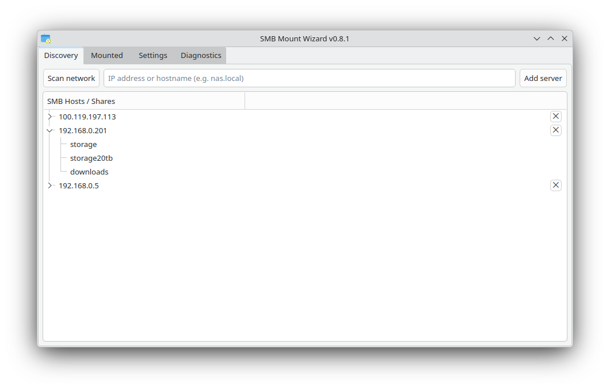
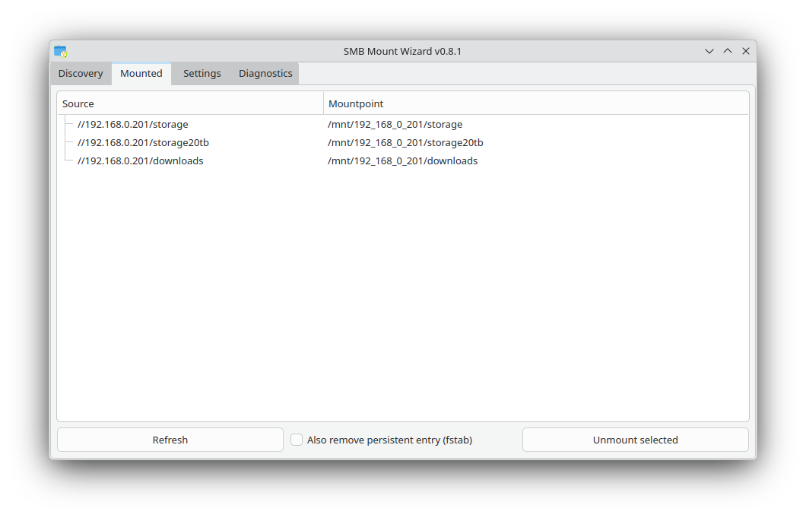
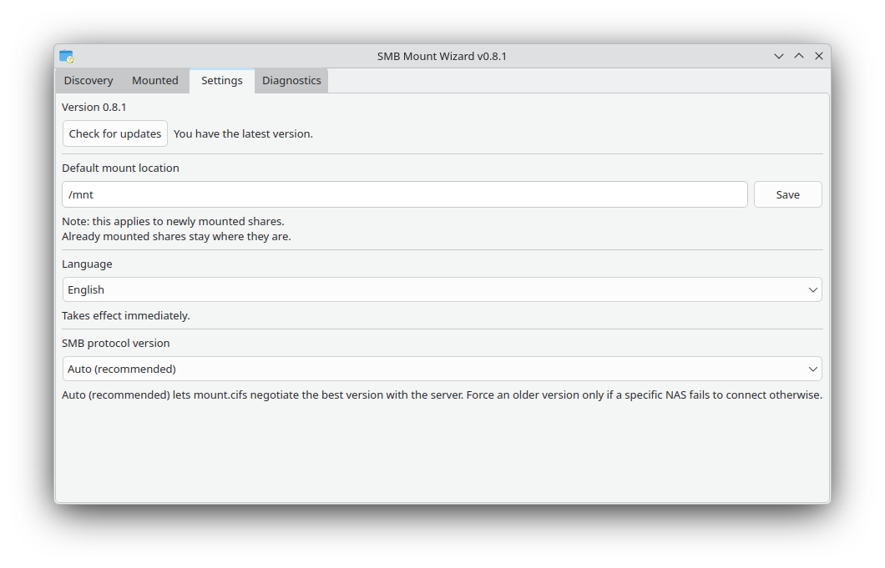
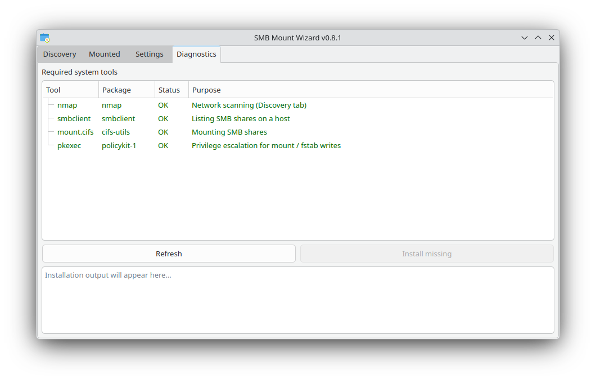

# SMB Mount Wizard

A small PyQt6 desktop app for Debian/KDE Plasma to discover and mount
SMB/CIFS network shares, without editing `/etc/fstab` by hand or
digging through Dolphin's network browser every time.

## Features

- **Discovery** - scans the local subnet for SMB hosts (or add one
  manually by IP/hostname), lists shares, mounts with one click.
- **Guest and authenticated mounts** - detects whether a share needs a
  login before asking, and only prompts for credentials when actually
  required.
- **Persistent mounts** - optionally writes a proper `/etc/fstab` entry
  (`x-systemd.automount`, credentials in a root-owned file) so a share
  survives a reboot, instead of requiring a manual re-mount every time.
- **Saved credentials** - remembers login details per (host, share)
  pair via the system keyring (KWallet / Secret Service), only after a
  mount has actually succeeded.
- **Mounted** tab - view and unmount active shares.
- **Diagnostics** tab - checks for required system tools (`nmap`,
  `smbclient`, `cifs-utils`, `pkexec`) and installs anything missing.
- **Settings** - default mount location, SMB protocol version override,
  and a live-switchable EN/PL interface language.

## Screenshots

| Discovery | Mounted |
|---|---|
|  |  |

| Settings | Diagnostics |
|---|---|
|  |  |

## Installation

### 1. Clone the repository

```bash
git clone https://github.com/TjomekPL/smb-mount-wizard.git
cd smb-mount-wizard
```

### 2. Install the required system packages (Debian)

```bash
sudo apt install python3-pip nmap smbclient cifs-utils policykit-1 libsecret-tools
```

`libsecret-tools` is optional - without it, credentials just aren't
remembered between sessions instead of the app failing. The app's own
**Diagnostics** tab can check for and install the rest of these after
you've got it running once.

### 3. Install the Python dependency

```bash
pip install -r requirements.txt --break-system-packages
```

### 4. Run it

```bash
python3 main.py
```

### 5. *(Optional)* Add it to the KDE application menu

So you don't need a terminal to launch it afterwards:

```bash
mkdir -p ~/.local/share/applications
cp packaging/smb-mount-wizard.desktop ~/.local/share/applications/
update-desktop-database ~/.local/share/applications
```

If you cloned the repo somewhere other than
`~/Desktop/smb-mount-wizard`, edit the `Exec=` and `Path=` lines in
`packaging/smb-mount-wizard.desktop` first to match your actual path.

### Installing a specific release instead of the latest code

To get a known, tagged version instead of whatever is newest on the
`main` branch:

```bash
git clone --branch v0.8.1 https://github.com/TjomekPL/smb-mount-wizard.git
```

See the [Releases](https://github.com/TjomekPL/smb-mount-wizard/releases)
page for the full list of tagged versions and what changed in each.

## Notes

- Mounting and any `/etc/fstab` changes go through `pkexec`, so you'll
  be prompted for your account password (not the share's) once per
  action.
- Mounted shares default to `file_mode=0600,dir_mode=0700` - only the
  mounting user can read the contents locally.
